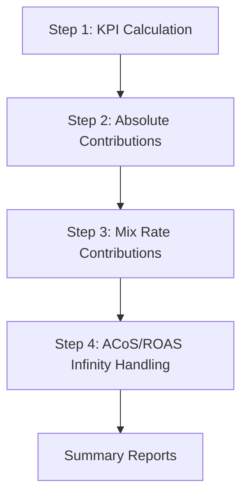

# vBridge2 Project Overview

A comprehensive documentation guide for the vBridge2 KPI Analysis and Mix/Rate Bridge Calculator system.

## 📚 Documentation Navigation

| Document | Purpose | Audience |
|----------|---------|----------|
| **[📖 README.md](README.md)** | Main project overview and quick start | All users |
| **[📖 README_vBridge.md](README_vBridge.md)** | Modular architecture details | Developers |
| **[📖 scripts/README_MODULAR.md](scripts/README_MODULAR.md)** | File structure breakdown | Developers |
| **[📖 output/README.md](output/README.md)** | Output files organization | Analysts |
| **[📖 IMPLEMENTATION_SUMMARY.md](IMPLEMENTATION_SUMMARY.md)** | Development history | Project managers |
| **[📖 PROJECT_OVERVIEW.md](PROJECT_OVERVIEW.md)** | This navigation guide | All users |

## 🎯 Project Purpose

vBridge2 is a sophisticated Python system for analyzing advertising campaign performance through:

1. **KPI Calculation**: 14 comprehensive advertising metrics
2. **Mix Analysis**: Campaign contribution to absolute metric changes
3. **Rate Analysis**: Decomposition of calculated metric changes
4. **Advanced Handling**: Special processing for ACoS/ROAS infinity cases

## 🏗️ System Architecture

### Modular Implementation

vBridge2 uses a **modular architecture** designed for production environments and complex integrations:

- **Pros**: Testable, maintainable, extensible, reusable components
- **Best for**: Production deployments, custom integrations, development work
- **Entry point**: `scripts/vBridge.py`

### Core Components

```
vBridge2/
├── 📄 README.md                    # Main documentation
├── 📄 README_vBridge.md           # Modular architecture guide
├── 📄 PROJECT_OVERVIEW.md         # This navigation guide
├── 📄 IMPLEMENTATION_SUMMARY.md   # Development history
├── 📄 kpi_format.py              # KPI formatting configuration
├── 📁 scripts/                   # Implementation files
│   ├── 📄 vBridge.py             # Main entry point
│   ├── 📄 vbridge_main.py        # Main orchestrator class
│   ├── 📄 config_manager.py      # Configuration management
│   ├── 📄 data_processor.py      # Data handling
│   ├── 📄 analysis_steps.py      # Analysis implementations
│   ├── 📄 __init__.py            # Package initialization
│   ├── 📄 test_vbridge.py        # Component tests
│   └── 📄 test_complete_analysis.py # Integration tests
├── 📁 output/                    # Generated analysis files
└── 📁 data files                # Input CSV files
```

## 🚀 Getting Started

### For First-Time Users

1. **Read**: [📖 Main README](README.md) for overview and quick start
2. **Setup Virtual Environment** (recommended):
   ```bash
   python3 -m venv venv
   source venv/bin/activate  # On macOS/Linux
   # or venv\Scripts\activate on Windows
   ```
3. **Install**: `pip install -r requirements.txt`
4. **Run**: `python scripts/vBridge.py`
5. **Review**: Check `output/` directory for results

### For Developers

1. **Architecture**: [📖 Modular README](README_vBridge.md)
2. **File Structure**: [📖 Modular Structure](scripts/README_MODULAR.md)
3. **Testing**: `python scripts/test_complete_analysis.py`
4. **Extending**: See modular documentation for custom components

### For Analysts

1. **Usage**: [📖 Main README](README.md) - Configuration section
2. **Outputs**: [📖 Output README](output/README.md) - File descriptions
3. **Validation**: Compare outputs with reference files using comparison scripts

## 📊 Analysis Workflow

### 4-Step Process



#### Step 1: KPI Calculation
- **Input**: Raw campaign CSV data
- **Process**: Calculate 14 KPIs for both periods
- **Output**: In-memory KPI datasets

#### Step 2: Absolute Contributions (Mix Analysis)
- **Input**: Period KPIs
- **Process**: Rate Change formula for 9 absolute metrics
- **Output**: 9 contribution files + 1 combined file

#### Step 3: Mix Rate Contributions
- **Input**: Period KPIs and mix shares
- **Process**: Mixed Rate Change formula for 5 calculated KPIs
- **Output**: 5 mix/rate contribution files

#### Step 4: ACoS/ROAS Infinity Handling
- **Input**: Previous step outputs
- **Process**: ROAS transformation for infinity cases
- **Output**: Final corrected ACoS/ROAS contributions

## 📈 Key Metrics Analyzed

### Absolute Metrics (9)
- Spend, Total Ad Sales, Impressions, Clicks, Total Ad Orders
- Same SKU Ad Sales, Other SKU Sales, Same SKU Ad Orders, Other SKU Ad Orders

### Calculated Metrics (5)
- ACoS, ROAS, Conversion Rate, CTR, CPC

### Analysis Types
- **M**: Mix analysis for absolute metrics
- **MR**: Mix Rate analysis for calculated metrics
- **MR+I**: Mix Rate with infinity handling for ACoS/ROAS

## 🔧 Configuration

### Data Requirements
- CSV file with campaign data
- Required columns: CampaignName, DateKey, Cost, Clicks, Impressions
- Attribution columns: AttributedSales7day, AttributedConversions7day, etc.

### Customization Points
- Column mappings in configuration
- Analysis periods (P1 vs P2 date ranges)
- Attribution windows (7-day, 14-day, 30-day)
- Output formatting preferences

## 🧪 Quality Assurance

### Testing Strategy
- **Unit Tests**: Individual component testing
- **Integration Tests**: End-to-end workflow validation
- **Comparison Scripts**: Validation against reference files
- **Synthetic Data**: Automated testing with generated data

### Validation Tools
- `test_complete_analysis.py` - Comprehensive test suite
- `test_vbridge.py` - Modular component tests

## 📁 Output Organization

### File Structure
```
output/
├── step2_absolute_contributions/     # 10 files (9 individual + 1 combined)
├── step3_mix_rate_contributions/     # 5 files (one per calculated KPI)
├── step4_acos_roas_final/           # 1 file (final contributions)
└── summary_reports/                 # 5 files (KPIs and changes)
```

### File Naming Convention
- `*_absolute_contribution.csv` - Step 2 outputs
- `*_mix_rate_contributions.csv` - Step 3 outputs
- `*_final_contributions.csv` - Step 4 outputs
- `p1_*` / `p2_*` - Period-specific files
- `*_mom_change.csv` - Month-over-month analysis

## 🔄 Migration Guide

### From Previous Versions
1. **Use only**: The modular `vBridge.py` system
2. **Updated**: Single entry point for complete analysis
3. **Enhanced**: 21+ output files with comprehensive coverage
4. **Improved**: Robust error handling and validation

### Backward Compatibility
- Existing import statements work
- Same output formats maintained
- All previous functionality preserved

## 🎯 Use Cases

### Business Analysts
- **Goal**: Understand campaign performance changes
- **Path**: Use `python scripts/vBridge.py` with default settings
- **Focus**: Summary reports and MoM change files

### Data Scientists
- **Goal**: Deep dive into mix vs. rate effects
- **Path**: Use modular components for custom analysis
- **Focus**: Individual contribution files and validation

### Developers
- **Goal**: Integrate into larger systems
- **Path**: Import and use modular components programmatically
- **Focus**: API interfaces and custom extensions

### Operations Teams
- **Goal**: Automated reporting pipelines
- **Path**: Deploy modular system with configuration management
- **Focus**: Error handling and monitoring

## 🔮 Future Roadmap

### Planned Enhancements
- Database integration (MongoDB, PostgreSQL)
- Web interface for interactive analysis
- API endpoints for programmatic access
- Advanced attribution modeling
- Real-time data processing

### Extension Points
- Custom analysis steps
- New data sources
- Alternative output formats
- Advanced visualization
- Machine learning integration

## 📞 Support Resources

### Documentation Hierarchy
1. **Quick Start**: [📖 Main README](README.md)
2. **Architecture**: [📖 Modular README](README_vBridge.md)
3. **Implementation**: [📖 Modular Structure](scripts/README_MODULAR.md)
4. **Outputs**: [📖 Output README](output/README.md)
5. **History**: [📖 Implementation Summary](IMPLEMENTATION_SUMMARY.md)

### Common Issues
- **Data Format**: Ensure CSV has required columns
- **Date Ranges**: Verify P1/P2 periods have data
- **Attribution**: Check 7-day vs 14-day column availability
- **Permissions**: Ensure write access to output directory

### Best Practices
- **Testing**: Always run test suite after changes
- **Validation**: Compare outputs with reference files
- **Configuration**: Use semantic formatting types
- **Documentation**: Update relevant README when extending

---

**This overview provides navigation to all project documentation. Start with the [📖 Main README](README.md) for immediate usage or dive into specific areas based on your role and needs.** 